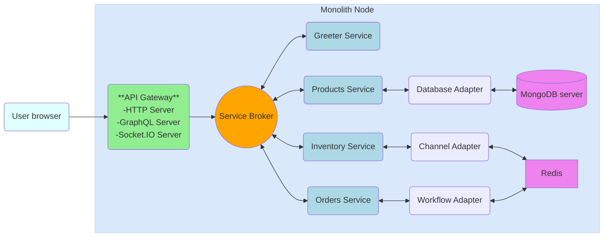
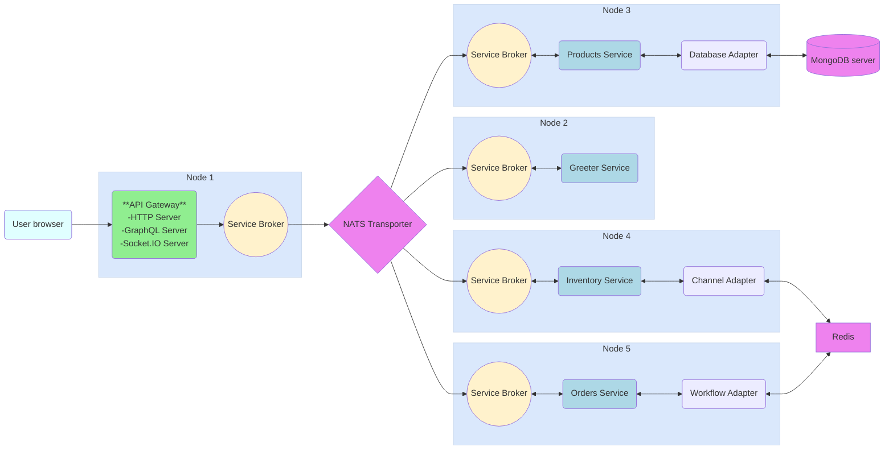

# project-demo
This is a [Moleculer](https://moleculer.services/)-based microservices project. Generated with the [Moleculer CLI](https://moleculer.services/docs/0.15/moleculer-cli.html).

## Template architecture
Moleculer supports different [deployment modes](https://moleculer.services/docs/0.15/clustering.html). The figures below represent the deployment and production architectures.
Switching between the architectures is [automatically](https://moleculer.services/docs/0.15/clustering.html) handled by moleculer. To run in dev mode use `npm run dev`, for production mode run `npm run dc:up`.

### Development architecture view

### Production architecture view

## Usage
Start the project with `npm run dev` command. 
After starting, open the http://localhost:3000/ URL in your browser. 
On the welcome page you can test the generated services via API Gateway and check the nodes & services.

Open the http://localhost:3000/graphql URL in your browser to access the GraphQL Playground.

In the terminal, try using [Moleculer REPL](https://moleculer.services/docs/0.15/moleculer-repl.html) by running the following commands:
- `nodes` - List all connected nodes.
- `services` - List all the available services.
- `actions` - List all registered service actions.
- `info` - List node info (e.g., IP, memory usage).
- `call greeter.hello` - Call the `greeter.hello` action.
- `call greeter.welcome --name John` - Call the `greeter.welcome` action with the `name` parameter.
- `call products.list` - List the products (call the `products.list` action).

## Services
- **api**: API Gateway services
- **greeter**: Sample service with `hello` and `welcome` actions.
- **products**: Sample DB service. To use with MongoDB, set `DB_URI` environment variables and install MongoDB adapter with `npm install mongodb`.
- **inventory**: Sample service with a single [`channel` handler](https://github.com/moleculerjs/moleculer-channels) that uses persistent queues to reliably process the messages.
- **workflows**: Workflow sample service.

## Mixins
- **db.mixin**: Database access mixin for services. Based on [moleculer/database](https://github.com/moleculerjs/database)

## Useful links

* Moleculer website: https://moleculer.services/
* Moleculer Documentation: https://moleculer.services/docs/0.15/
* Moleculer Database service: https://github.com/moleculerjs/database
* Moleculer API Gateway: https://moleculer.services/docs/0.15/moleculer-web.html
* Moleculer GraphQL Gateway: https://github.com/moleculerjs/moleculer-apollo-server
* Moleculer Socket.IO Gateway: https://github.com/moleculerjs/moleculer-io
* Moleculer Channels: https://github.com/moleculerjs/moleculer-channels
* Moleculer Workflows: https://github.com/moleculerjs/workflows

## NPM scripts

- `npm run dev`: Start development mode (load all services locally with hot-reload & REPL)
- `npm run start`: Start production mode (set `SERVICES` env variable to load certain services)
- `npm run cli`: Start a CLI and connect to production. Don't forget to set production namespace with `--ns` argument in script
- `npm run lint`: Run ESLint
- `npm run ci`: Run continuous test mode with watching
- `npm test`: Run tests & generate coverage report
- `npm run dc:up`: Start the stack with Docker Compose
- `npm run dc:down`: Stop the stack with Docker Compose
